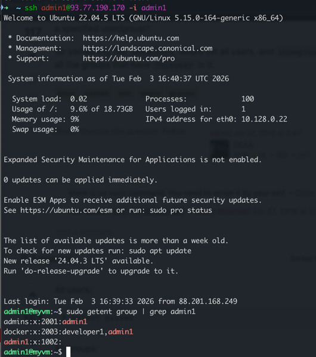
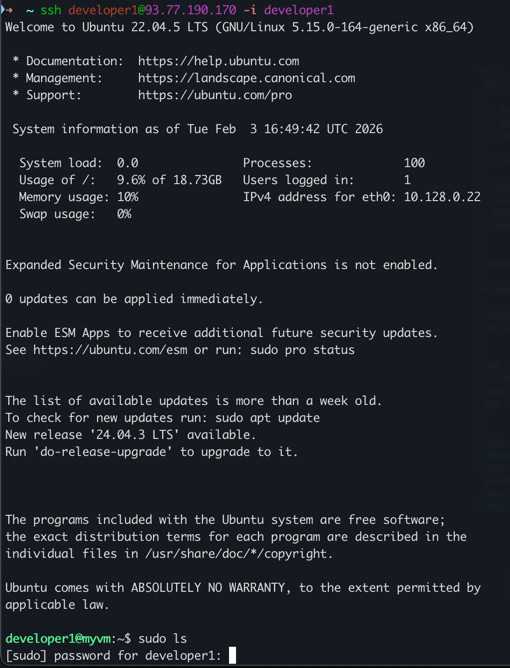
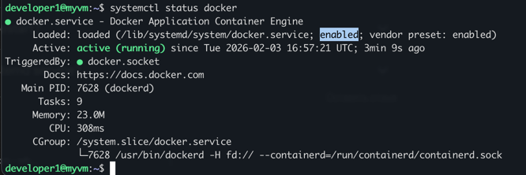
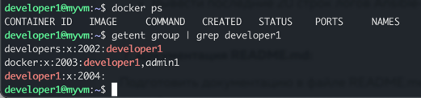
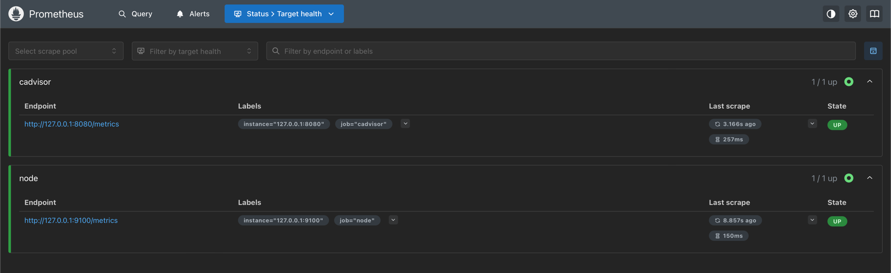
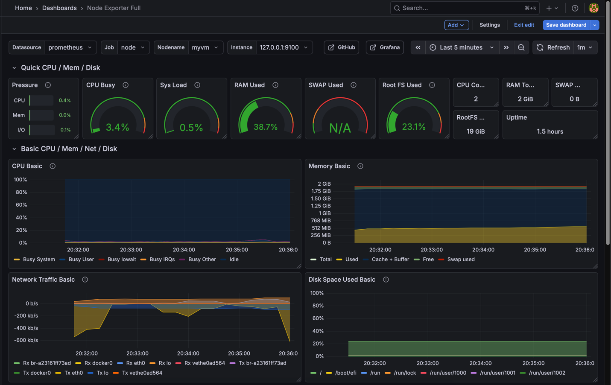
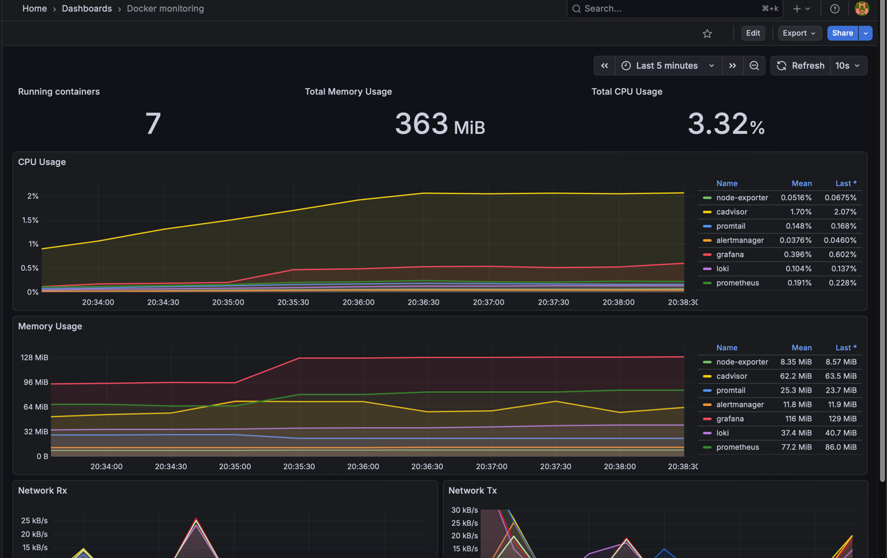
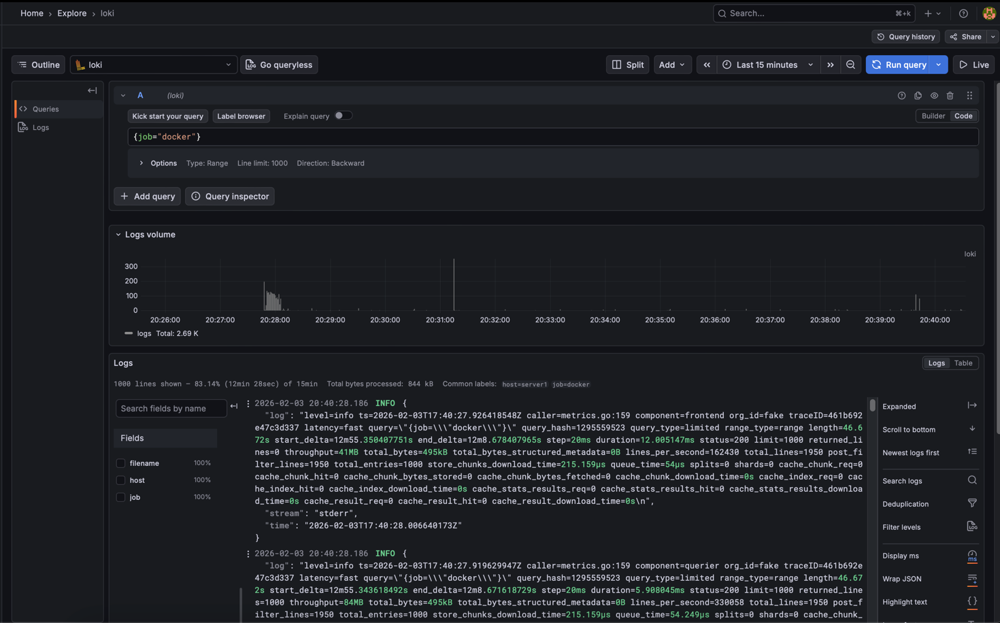

# usatov.n-itmo-megaschool-devops-2026

- [Все файлы необходимые для работы с Ansible](ansible)
- [Docker-compose файлы с дополнительными сервисами](ansible/roles/monitoring/docker-compose/docker-compose.yml) и их [конфиги](ansible/roles/monitoring/files)
- JSON-файл дашборда Grafana: [1](ansible/roles/monitoring/grafana/dashboards/node-exporter.json) [2](ansible/roles/monitoring/grafana/dashboards/docker-cadvisor.json)
- Файл с логами выполнения Ansible: [1](ansible-vvvv.log) и [2](ansible.log)

# Развертывание инфраструктуры с использованием Ansible и Docker

## Try it out

1) Прописать свой(и) хост(ы) в [инвентори](ansible/inventory/hosts.ini) и имя пользователя
2) ```
   cd ansible
   ansible-playbook site.yml -i inventory/hosts.ini
   ```

Произойдет полная настройка инфраструктуры - от создания групп пользователей в Linux до развертывания инфраструктуры мониторинга.

Графана будет доступна по 3000 порту хоста.

## Контроль доступа пользователей

- Реализована Ansible-роль, создающая группы пользователей Admins (2001) и Developers (2002)
- Также создаются пользователи, публичные ключи которых прокидываются на хост
- Создается группа Docker для дальнейшего использования команд docker без sudo


#### sudo для admin-пользователя без пароля


#### sudo для developer-пользователя требует пароль


## Контейнеризация

- Ansible-роль:
- Установка необходимых пакетов
- Установка GPG-ключа
- Установка сервиса Docker с зеркалами-прокси, указанными в vars
- Включение автозапуска сервиса docker.service


#### Включенный Docker systemd сервис


#### Разработчик использует Docker без sudo


## Мониторинг

- Ansible-роль
- Установлен Node Exporter для сбора метрик с хоста
- Установлен cAdvisor для сбор метрик с Docker-контейнеров
- Установлены инструменты мониторинга:
  - Grafana - для отображения метрик, логов - универсальное решение, поддерживает большое количество источников данных, кроме метрик хорошо справляется с отображением логов
  - Prometheus - для сборки метрик с хоста
  - Loki - система агрегации логов
  - Promtail - агент сбора логов с хоста

**Данные решения были выбраны из-за их универсальности и потому что они хорошо подходят друг другу и имеют инструменты интеграции. Например, не нужно разворачивать отдельную Кибану для отображения логов**

- Из общей библиотеки дашбордов выбраны дашборды Node Exporter Full и Docker Monitoring

- Дополнительно настроен Provisioning Grafana, для выкатки источников данных и дашбордов, что позволяет использовать подход Infrastructure as Code.

#### Prometheus таргеты


#### Node Exporter Dashboard


#### Docker Monitoring


#### Вывод логов с помощью Loki-датасурса в графане


## Логи работы

[Ansible Log Last 20](ansible.log)
```
TASK [monitoring : Copy dashboards] *******************************************************************************************************************************************************
ok: [server1]

TASK [monitoring : Copy docker-compose] ***************************************************************************************************************************************************
ok: [server1]

TASK [monitoring : Deploy configs] ********************************************************************************************************************************************************
ok: [server1] => (item=prometheus.yml)
ok: [server1] => (item=loki.yml)

TASK [monitoring : Deploy template configs] ***********************************************************************************************************************************************
ok: [server1] => (item=promtail.yml.j2)

TASK [monitoring : Stop monitoring stack] *************************************************************************************************************************************************
changed: [server1]

TASK [monitoring : Start monitoring stack] ************************************************************************************************************************************************
changed: [server1]

PLAY RECAP ********************************************************************************************************************************************************************************
server1                    : ok=9    changed=2    unreachable=0    failed=0    skipped=0    rescued=0    ignored=0

```

[Ansible Log Last 20 Verbose](ansible-vvvv.log)
```
        " Container grafana Starting ",
        " Container loki Starting ",
        " Container alertmanager Starting ",
        " Container node-exporter Starting ",
        " Container prometheus Starting ",
        " Container cadvisor Starting ",
        " Container promtail Started ",
        " Container grafana Started ",
        " Container prometheus Started ",
        " Container loki Started ",
        " Container cadvisor Started ",
        " Container node-exporter Started ",
        " Container alertmanager Started "
    ],
    "stdout": "",
    "stdout_lines": []
}

PLAY RECAP ********************************************************************************************************************************************************************************
server1                    : ok=25   changed=3    unreachable=0    failed=0    skipped=0    rescued=0    ignored=0

```

[Docker Compose all containers last 20 logs](docker-compose.log)
```
prometheus  | time=2026-02-03T18:38:23.333Z level=INFO source=main.go:1589 msg="updated GOGC" old=100 new=75
prometheus     | time=2026-02-03T18:38:23.345Z level=INFO source=main.go:704 msg="Leaving GOMAXPROCS=2: CPU quota undefined" component=automaxprocs
prometheus     | time=2026-02-03T18:38:23.349Z level=INFO source=memlimit.go:198 msg="GOMEMLIMIT is updated" component=automemlimit package=github.com/KimMachineGun/automemlimit/memlimit GOMEMLIMIT=1852143206 previous=9223372036854775807
prometheus     | time=2026-02-03T18:38:23.349Z level=INFO source=main.go:752 msg="No time or size retention was set so using the default time retention" duration=15d
prometheus     | time=2026-02-03T18:38:23.350Z level=INFO source=main.go:803 msg="Starting Prometheus Server" mode=server version="(version=3.9.1, branch=HEAD, revision=9ec59baffb547e24f1468a53eb82901e58feabd8)"
prometheus     | time=2026-02-03T18:38:23.350Z level=INFO source=main.go:808 msg="operational information" build_context="(go=go1.25.5, platform=linux/amd64, user=root@61c3a9212c9e, date=20260107-16:08:09, tags=netgo,builtinassets)" host_details="(Linux 5.15.0-164-generic #174-Ubuntu SMP Fri Nov 14 20:25:16 UTC 2025 x86_64 myvm (none))" fd_limits="(soft=524287, hard=524288)" vm_limits="(soft=unlimited, hard=unlimited)"
prometheus     | time=2026-02-03T18:38:23.360Z level=INFO source=web.go:684 msg="Start listening for connections" component=web address=0.0.0.0:9090
prometheus     | time=2026-02-03T18:38:23.361Z level=INFO source=main.go:1331 msg="Starting TSDB ..."
prometheus     | time=2026-02-03T18:38:23.397Z level=INFO source=head.go:681 msg="Replaying on-disk memory mappable chunks if any" component=tsdb
prometheus     | time=2026-02-03T18:38:23.397Z level=INFO source=head.go:767 msg="On-disk memory mappable chunks replay completed" component=tsdb duration=2.588µs
prometheus     | time=2026-02-03T18:38:23.397Z level=INFO source=head.go:775 msg="Replaying WAL, this may take a while" component=tsdb
prometheus     | time=2026-02-03T18:38:23.397Z level=INFO source=head.go:848 msg="WAL segment loaded" component=tsdb segment=0 maxSegment=0 duration=200.786µs
prometheus     | time=2026-02-03T18:38:23.397Z level=INFO source=head.go:885 msg="WAL replay completed" component=tsdb checkpoint_replay_duration=44.097µs wal_replay_duration=235.459µs wbl_replay_duration=142ns chunk_snapshot_load_duration=0s mmap_chunk_replay_duration=2.588µs total_replay_duration=308.546µs
prometheus     | time=2026-02-03T18:38:23.398Z level=INFO source=tls_config.go:354 msg="Listening on" component=web address=[::]:9090
prometheus     | time=2026-02-03T18:38:23.398Z level=INFO source=tls_config.go:357 msg="TLS is disabled." component=web http2=false address=[::]:9090
prometheus     | time=2026-02-03T18:38:23.405Z level=INFO source=main.go:1352 msg="filesystem information" fs_type=EXT4_SUPER_MAGIC
prometheus     | time=2026-02-03T18:38:23.405Z level=INFO source=main.go:1355 msg="TSDB started"
prometheus     | time=2026-02-03T18:38:23.405Z level=INFO source=main.go:1542 msg="Loading configuration file" filename=/etc/prometheus/prometheus.yml
prometheus     | time=2026-02-03T18:38:23.412Z level=INFO source=main.go:1582 msg="Completed loading of configuration file" db_storage=1.643µs remote_storage=2.376µs web_handler=565ns query_engine=1.535µs scrape=2.204367ms scrape_sd=47.538µs notify=1.568µs notify_sd=1.101µs rules=11.835µs tracing=7.352µs filename=/etc/prometheus/prometheus.yml totalDuration=6.369557ms
prometheus     | time=2026-02-03T18:38:23.412Z level=INFO source=main.go:1316 msg="Server is ready to receive web requests."
prometheus     | time=2026-02-03T18:38:23.412Z level=INFO source=manager.go:202 msg="Starting rule manager..." component="rule manager"
...
promtail       | level=info ts=2026-02-03T18:38:28.238346662Z caller=tailer.go:145 component=tailer msg="tail routine: started" path=/var/lib/docker/containers/76fa4fc61f2686bb9e7ba47f61593bb718657e073767a55ab42afa34075cd93c/76fa4fc61f2686bb9e7ba47f61593bb718657e073767a55ab42afa34075cd93c-json.log
promtail       | ts=2026-02-03T18:38:28.2383693Z caller=log.go:168 level=info msg="Seeked /var/lib/docker/containers/8f6a5fcc3b2692ed826336909be2323797e657608fad9c82685fcebc6ddd334f/8f6a5fcc3b2692ed826336909be2323797e657608fad9c82685fcebc6ddd334f-json.log - &{Offset:0 Whence:0}"
promtail       | level=info ts=2026-02-03T18:38:28.238380614Z caller=tailer.go:145 component=tailer msg="tail routine: started" path=/var/lib/docker/containers/8f6a5fcc3b2692ed826336909be2323797e657608fad9c82685fcebc6ddd334f/8f6a5fcc3b2692ed826336909be2323797e657608fad9c82685fcebc6ddd334f-json.log
promtail       | ts=2026-02-03T18:38:28.238407471Z caller=log.go:168 level=info msg="Seeked /var/lib/docker/containers/a601a4296304f2f72d0760973b7dbabe4ef6d7485bcc4502b53d4ab62a4d42d1/a601a4296304f2f72d0760973b7dbabe4ef6d7485bcc4502b53d4ab62a4d42d1-json.log - &{Offset:0 Whence:0}"
promtail       | level=info ts=2026-02-03T18:38:28.23841754Z caller=tailer.go:145 component=tailer msg="tail routine: started" path=/var/lib/docker/containers/a601a4296304f2f72d0760973b7dbabe4ef6d7485bcc4502b53d4ab62a4d42d1/a601a4296304f2f72d0760973b7dbabe4ef6d7485bcc4502b53d4ab62a4d42d1-json.log
promtail       | ts=2026-02-03T18:38:28.238452902Z caller=log.go:168 level=info msg="Seeked /var/lib/docker/containers/b902e5428a6f65bfc33ae8f02bcbc395d84ce12aa58ed00e5eec877f633b3b7e/b902e5428a6f65bfc33ae8f02bcbc395d84ce12aa58ed00e5eec877f633b3b7e-json.log - &{Offset:0 Whence:0}"
promtail       | level=info ts=2026-02-03T18:38:28.238464319Z caller=tailer.go:145 component=tailer msg="tail routine: started" path=/var/lib/docker/containers/b902e5428a6f65bfc33ae8f02bcbc395d84ce12aa58ed00e5eec877f633b3b7e/b902e5428a6f65bfc33ae8f02bcbc395d84ce12aa58ed00e5eec877f633b3b7e-json.log
promtail       | ts=2026-02-03T18:38:28.23848453Z caller=log.go:168 level=info msg="Seeked /var/lib/docker/containers/cf07e1f5e7d6491ac7c5b46154c2b6a34fb9d37d0be415905ae038e817027ea7/cf07e1f5e7d6491ac7c5b46154c2b6a34fb9d37d0be415905ae038e817027ea7-json.log - &{Offset:0 Whence:0}"
promtail       | level=info ts=2026-02-03T18:38:28.238493989Z caller=tailer.go:145 component=tailer msg="tail routine: started" path=/var/lib/docker/containers/cf07e1f5e7d6491ac7c5b46154c2b6a34fb9d37d0be415905ae038e817027ea7/cf07e1f5e7d6491ac7c5b46154c2b6a34fb9d37d0be415905ae038e817027ea7-json.log
promtail       | level=info ts=2026-02-03T18:38:28.239420783Z caller=tailer.go:145 component=tailer msg="tail routine: started" path=/var/log/apt/history.log
promtail       | ts=2026-02-03T18:38:28.239495416Z caller=log.go:168 level=info msg="Seeked /var/log/apt/term.log - &{Offset:0 Whence:0}"
promtail       | ts=2026-02-03T18:38:28.239507382Z caller=log.go:168 level=info msg="Seeked /var/log/cloud-init-output.log - &{Offset:0 Whence:0}"
promtail       | level=info ts=2026-02-03T18:38:28.240963788Z caller=tailer.go:145 component=tailer msg="tail routine: started" path=/var/log/cloud-init-output.log
promtail       | ts=2026-02-03T18:38:28.241001176Z caller=log.go:168 level=info msg="Seeked /var/log/cloud-init.log - &{Offset:0 Whence:0}"
promtail       | level=info ts=2026-02-03T18:38:28.241025233Z caller=tailer.go:145 component=tailer msg="tail routine: started" path=/var/log/apt/term.log
promtail       | ts=2026-02-03T18:38:28.241092015Z caller=log.go:168 level=info msg="Seeked /var/log/landscape/sysinfo.log - &{Offset:0 Whence:0}"
promtail       | level=info ts=2026-02-03T18:38:28.241119144Z caller=tailer.go:145 component=tailer msg="tail routine: started" path=/var/log/landscape/sysinfo.log
promtail       | ts=2026-02-03T18:38:28.241137777Z caller=log.go:168 level=info msg="Seeked /var/log/unattended-upgrades/unattended-upgrades-shutdown.log - &{Offset:0 Whence:0}"
promtail       | level=info ts=2026-02-03T18:38:28.241150306Z caller=tailer.go:145 component=tailer msg="tail routine: started" path=/var/log/unattended-upgrades/unattended-upgrades-shutdown.log
promtail       | ts=2026-02-03T18:38:28.241174222Z caller=log.go:168 level=info msg="Seeked /var/log/auth.log - &{Offset:0 Whence:0}"
promtail       | level=info ts=2026-02-03T18:38:28.241183237Z caller=tailer.go:145 component=tailer msg="tail routine: started" path=/var/log/auth.log
promtail       | level=info ts=2026-02-03T18:38:28.241233412Z caller=tailer.go:145 component=tailer msg="tail routine: started" path=/var/log/dpkg.log
alertmanager  | time=2026-02-03T18:38:23.547Z level=INFO source=main.go:191 msg="Starting Alertmanager" version="(version=0.31.0, branch=HEAD, revision=0ae07a09fbb26a7738c867306f32b5f42583a7d2)"
alertmanager   | time=2026-02-03T18:38:23.548Z level=INFO source=main.go:194 msg="Build context" build_context="(go=go1.25.6, platform=linux/amd64, user=root@47d5a7c91e78, date=20260202-13:00:37, tags=netgo)"
alertmanager   | time=2026-02-03T18:38:23.548Z level=INFO source=cluster.go:192 msg="setting advertise address explicitly" component=cluster addr=172.18.0.2 port=9094
alertmanager   | time=2026-02-03T18:38:23.554Z level=INFO source=cluster.go:682 msg="Waiting for gossip to settle..." component=cluster interval=2s
alertmanager   | time=2026-02-03T18:38:23.655Z level=INFO source=coordinator.go:111 msg="Loading configuration file" component=configuration file=/etc/alertmanager/alertmanager.yml
alertmanager   | time=2026-02-03T18:38:23.658Z level=INFO source=coordinator.go:124 msg="Completed loading of configuration file" component=configuration file=/etc/alertmanager/alertmanager.yml
alertmanager   | time=2026-02-03T18:38:23.662Z level=INFO source=tls_config.go:354 msg="Listening on" address=[::]:9093
alertmanager   | time=2026-02-03T18:38:23.666Z level=INFO source=tls_config.go:357 msg="TLS is disabled." http2=false address=[::]:9093
alertmanager   | time=2026-02-03T18:38:25.556Z level=INFO source=cluster.go:707 msg="gossip not settled" component=cluster polls=0 before=0 now=1 elapsed=2.000199046s
alertmanager   | time=2026-02-03T18:38:33.557Z level=INFO source=cluster.go:699 msg="gossip settled; proceeding" component=cluster elapsed=10.001763713s
cadvisor       | I0203 18:38:23.431853       1 manager.go:234] Version: {KernelVersion:5.15.0-164-generic ContainerOsVersion:Alpine Linux v3.22 DockerVersion: DockerAPIVersion: CadvisorVersion:v0.55.1 CadvisorRevision:f5bec374}
cadvisor       | I0203 18:38:23.432139       1 factory.go:55] Registering systemd factory
cadvisor       | I0203 18:38:23.432153       1 factory.go:222] Registration of the systemd container factory successfully
cadvisor       | I0203 18:38:23.432341       1 factory.go:220] Registration of the crio container factory failed: Get "http://%2Fvar%2Frun%2Fcrio%2Fcrio.sock/info": dial unix /var/run/crio/crio.sock: connect: no such file or directory
cadvisor       | I0203 18:38:23.435985       1 factory.go:148] Registering containerd factory
cadvisor       | I0203 18:38:23.436043       1 factory.go:222] Registration of the containerd container factory successfully
cadvisor       | I0203 18:38:23.470578       1 factory.go:362] Registering Docker factory
cadvisor       | I0203 18:38:23.470604       1 factory.go:222] Registration of the docker container factory successfully
cadvisor       | I0203 18:38:23.470786       1 factory.go:220] Registration of the podman container factory failed: failed to validate Podman info: response not present: Get "http://d/v1.0.0/info": dial unix /var/run/podman/podman.sock: connect: no such file or directory
cadvisor       | I0203 18:38:23.470825       1 factory.go:105] Registering Raw factory
cadvisor       | I0203 18:38:23.470840       1 manager.go:1211] Started watching for new ooms in manager
cadvisor       | W0203 18:38:23.470858       1 manager.go:338] Could not configure a source for OOM detection, disabling OOM events: open /dev/kmsg: no such file or directory
cadvisor       | I0203 18:38:23.471252       1 manager.go:351] Starting recovery of all containers
cadvisor       | I0203 18:38:23.822487       1 manager.go:356] Recovery completed
cadvisor       | I0203 18:38:23.858079       1 cadvisor.go:179] Starting cAdvisor version: v0.55.1-f5bec374 on port 8080
...
grafana        | logger=backgroundsvcs.managerAdapter t=2026-02-03T18:38:24.676776428Z level=info msg=starting module=*loginattemptimpl.Service
grafana        | logger=backgroundsvcs.managerAdapter t=2026-02-03T18:38:24.676818979Z level=info msg=starting module=*updatemanager.PluginsService
grafana        | logger=backgroundsvcs.managerAdapter t=2026-02-03T18:38:24.677423765Z level=info msg=starting module=*rendering.RenderingService
grafana        | logger=backgroundsvcs.managerAdapter t=2026-02-03T18:38:24.679068544Z level=info msg=starting module=*cleanup.CleanUpService
grafana        | logger=backgroundsvcs.managerAdapter t=2026-02-03T18:38:24.680645947Z level=info msg=starting module=*ssosettingsimpl.Service
grafana        | logger=backgroundsvcs.managerAdapter t=2026-02-03T18:38:24.680788209Z level=info msg=starting module=*manager.SecretsService
grafana        | logger=backgroundsvcs.managerAdapter t=2026-02-03T18:38:24.680900236Z level=info msg=starting module=*updatemanager.GrafanaService
grafana        | logger=backgroundsvcs.managerAdapter t=2026-02-03T18:38:24.681058821Z level=info msg=starting module=*ngalert.AlertNG
grafana        | logger=ngalert.state.manager t=2026-02-03T18:38:24.68113978Z level=info msg="Warming state cache for startup"
grafana        | logger=backgroundsvcs.managerAdapter t=2026-02-03T18:38:24.682306715Z level=info msg=starting module=*supportbundlesimpl.Service
grafana        | logger=ngalert.multiorg.alertmanager t=2026-02-03T18:38:24.688398845Z level=info msg="Starting MultiOrg Alertmanager"
grafana        | logger=backgroundsvcs.managerAdapter t=2026-02-03T18:38:24.688489903Z level=info msg="All modules healthy"
grafana        | logger=ngalert.state.manager t=2026-02-03T18:38:24.688831293Z level=info msg="State cache has been initialized" states=0 duration=7.689671ms
grafana        | logger=ngalert.scheduler t=2026-02-03T18:38:24.689038285Z level=info msg="Starting scheduler" tickInterval=10s maxAttempts=3
grafana        | logger=ngalert.scheduler t=2026-02-03T18:38:24.689126313Z level=info msg=starting component=ticker first_tick=2026-02-03T18:38:30Z
grafana        | logger=plugins.update.checker t=2026-02-03T18:38:24.798526238Z level=info msg="Update check succeeded" duration=121.649164ms
grafana        | logger=grafana.update.checker t=2026-02-03T18:38:24.837576489Z level=info msg="Update check succeeded" duration=156.622339ms
grafana        | logger=context userId=1 orgId=1 uname=admin t=2026-02-03T18:38:25.682402164Z level=info msg="Request Completed" method=GET path=/api/live/ws status=-1 remote_addr=88.201.168.249 time_ms=7 duration=7.315144ms size=0 referer= handler=/api/live/ws status_source=server
grafana        | logger=context userId=1 orgId=1 uname=admin t=2026-02-03T18:38:32.073021345Z level=info msg="Request Completed" method=GET path=/api/live/ws status=-1 remote_addr=88.201.168.249 time_ms=3 duration=3.06904ms size=0 referer= handler=/api/live/ws status_source=server
grafana        | logger=infra.usagestats t=2026-02-03T18:39:07.679012346Z level=info msg="Usage stats are ready to report"
```